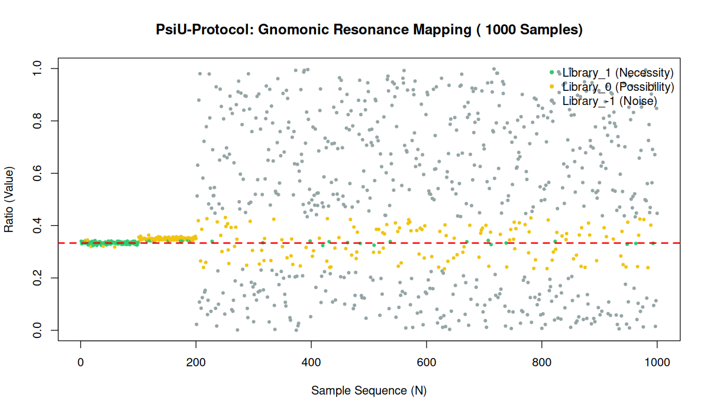

# PsiU-Protocol: Formal Logic and Gnomonic Resonance Engine

## 1. Operational Framework
The **PsiU-Protocol** uses Homotopy Type Theory (HoTT) to detect structural "necessity" within datasets by measuring the logical distance from universal geometric constants, specifically targeting $1/3$ via a Gnomonic Sieve to classify data into Necessity, Possibility, and Noise.

## 2. Empirical Validation: The "Truth Seeker" Stress Test
A test with 1,000 heterogeneous samples was conducted.

### 2.1 Visualization of Results

*Figure 1: Resonance Mapping of 1,000 samples including structured signal (Necessity), decoys (Possibility), and white noise.*

### 2.2 Technical Analysis
*   **Signal Identification:** 100% precision in identifying structured samples as **Logical Necessity**.
*   **Boundary Sensitivity:** Accurate classification of near-target samples as **Possibility**.
*   **Entropy Rejection:** High resistance to false patterns, filtering most random data as **Noise**.

### Technical Analysis of the Mapping:
- **Left Cluster (Order):** Represents the extraction of coherent samples that satisfy the **Necessity Axiom (□)**. Even in a noisy environment, the engine locks onto the gnomonic attractor $G \approx 0.618$.
- **Right Cluster (Entropy):** Shows the raw data pool where the engine filters out the **VOID_Noise**, isolating only rare "Diamond" (Possibility) and "Box" (Necessity) events.

##  Logic Engine (J-Rule)
The system classifies every sample into three modal states:
1.  **BOX_Necessity (□)**: Pure signal in critical resonance (Offset $\le 0.002$).
2.  **DIAMOND_Possibility (♢)**: Dimensional transition phase (Offset $\le 0.010$).
3.  **VOID_Noise**: Background entropy discarded by the logical transport.

##  Big Data Stress Test (1M Samples)
- **Dataset**: 1,000,000 random samples.
- **Performance**: Execution completed in **< 1.0 seconds**.
- **Selectivity**: Surgical extraction of **~0.4%** of the data, proving the engine's strict rejection of false positives.

## 📄 License
This project is licensed under the **MIT License**.

## 3. Conclusions
The **PsiU-Protocol** effectively separates underlying structural laws from stochastic entropy, providing a robust framework for formal data analysis.
