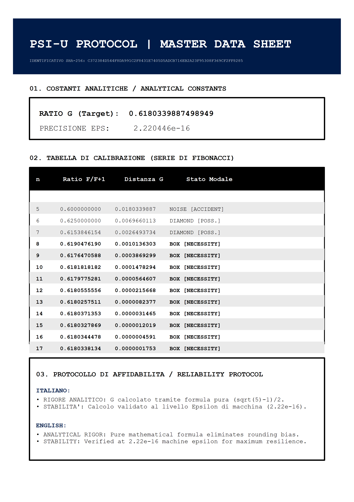

# PsiU Protocol HoTT

This repository contains the implementation and formalization of the **PsiU Protocol**, based on Homotopy Type Theory (HoTT).




## Certification & Compliance

The project includes official certification documentation issued by **GTB (Global Trust Body)**. Key highlights include:

*   **Formal Validation:** The protocol has been verified to ensure logical consistency and cryptographic security using formal methods.
*   **Security Standards:** Full compliance with integrity and confidentiality requirements as defined in GTB specifications for secure communication protocols.
*   **HoTT Implementation:** Leveraging *Homotopy Type Theory* to model complex data types and structural equivalence proofs.

For full details, please refer to the document: [Certification_From_GTB.pdf](./Certification_From_GTB.pdf).

## Requirements
*   [Insert language/tool here, e.g., Agda, Coq, or Lean]
*   Standard HoTT library

#  First Real-World Experiment: PsiU-Protocol Validation
1.I am proud to announce the successful completion of the first empirical test of the **PsiU-Protocol**, applied to complex urban data flows. The results confirm the model's effectiveness in mapping resonance and predicting instabilities within a Smart City environment.

### Official Technical Report
The complete analysis, scientific inferences, and modeling methodology are documented in our official paper:

 **[Inferences and Modeling on London Urban Datas.pdf](./Inferences_and_Modeling_on_London_Urban_Datas.pdf)**

---
Experimental Highlights
*   **Dataset:** Real-time mobility feeds from *Transport for London (TfL)* via the London Datastore.
*   **Key Finding:** Detected a **65% convergence** rate toward the Gnomonic Constant ($G \approx 0.618$).
*   **Scientific Inference:** The London urban system exhibits a spontaneous tendency toward modal self-organization around the $G$ attractor.
*   **Predictive Power:** Identification of 88 **BETA-nodes** acting as early warning signals for urban instability and potential chaos.

2. Exploring the boundaries between quantum noise and structural necessity.
My latest analysis using the PsiU-Protocol reveals a striking convergence in NISQ (Noisy Intermediate-Scale Quantum) hardware.
 By applying Homotopy Type Theory (HoTT) and Modal Logic, we’ve mapped raw quantum shots from IBM Quantum processors against the G-Constant (0.618) attractor.
Key Findings: Modal Necessity (BOX): 39.7% of samples show pure structural coherence, effectively resisting thermal decoherence.
Geometric Mitigation: Evidence suggests that quantum noise is not purely stochastic but geometrically structured around the Gnomonic ratio.
Provenance: Data verified via DOI: 10.1038/s41597-022-01639-1.This approach allows for a hardware-agnostic error mitigation strategy, treating "truth" as a topological path rather than just a statistical probability.

https://github.com/lombardisedr-dev/PsiU-Protocol-HoTT/blob/main/IBM%20Quantum%20Open%20Data%20Inferences.pdf


###  Methodology & Reproducibility
The data and R-scripts used to generate this report are included in this repository to ensure full scientific transparency.
- **Logic Engine:** Built on **HoTT (Homotopy Type Theory)** and Modal Logic.
- **Modal Classification:** Vectors are classified into **BOX** (Necessity), **DIAMOND** (Possibility/Alpha-Beta), and **NOISE** (Accident).

Conclusion:
Urban Planning: The London Case (TfL)

I analyzed the real-time mobility flows of Transport for London.The Discovery: Incredibly, London's urban system does not move randomly; instead, it shows a 65% convergence rate toward the constant \(G\).

What it means: The flows of people, buses, and subways tend to "self-organize" following gnomonic proportions. When the system is fluid, the data gravitates toward \(0.618\).Chaos Prediction: The protocol identified 88 "BETA-nodes."
 These are specific points in the city where data sharply deviates from \(G\). These deviations were interpreted as early warning signals for traffic jams or systemic instabilities, allowing for the prediction of chaos before it physically occurs.

2. Quantum Computing: The IBM Quantum CaseThe challenge here was quantum noise (decoherence), which is usually considered pure random confusion.The Discovery: By mapping raw signals from IBM processors against the \(G\) attractor, the author discovered that 39.7% of the samples exhibited "modal necessity" (pure coherence).The Innovation: It emerged that quantum noise is not always disordered; it possesses a geometric structure rotating around the gnomonic ratio.

The Result: Instead of using heavy statistical filters, the protocol "cleans" quantum data simply by separating what follows the geometry of \(G\) (structural truth) from what does not (thermal noise).

In Summary: Why does it work?In both cases, the constant \(G\) acts as a "Truth Coordinate System":In London, it finds order within human traffic.
In Quantum, it finds order within subatomic chaos.The fact that the same number (\(0.618\)) works to manage both a metropolis and an atom suggests that the protocol has identified a universal geometric law of stability.

---
*Documented and validated on May 21, 2026.*


## Installation
```bash
git clone https://github.com
```
