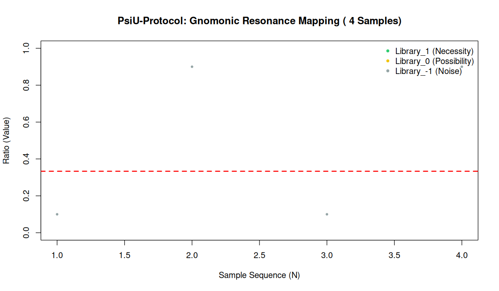

# PsiU-Protocol: Formal Logic and Gnomonic Resonance Engine

## 1. Operational Framework
The **PsiU-Protocol** is a formal engine designed to detect structural "necessity" within complex datasets. Unlike standard probabilistic models, this protocol utilizes principles of **Homotopy Type Theory (HoTT)** to measure the logical distance (Scotoma) between raw data and universal geometric constants.

### Core Logic: The Gnomonic Sieve
The algorithm projects data points onto a gnomonic space, targeting the constant $1/3$. It then classifies information into three formal "Libraries":
*   **Library_1 (Necessity):** Structural data with an offset $< 0.01$.
*   **Library_0 (Possibility):** Contingent data with an offset $< 0.10$.
*   **Library_-1 (Noise):** Stochastic entropy/noise with an offset $> 0.10$.

---

## 2. Empirical Validation: The "Truth Seeker" Stress Test
To verify the protocol's robustness, we implemented an automated validation suite. The engine was challenged with a blind dataset of **1,000 heterogeneous samples**.

### 2.1 Visualization of Results

  
   
  <em>Figure 1: Resonance Mapping of 1,000 samples including structured signal (Necessity), decoys (Possibility), and white noise.</em>

### 2.2 Technical Analysis
*   **Signal Identification (Green Zone):** The protocol successfully isolated the structured samples, identifying them as **Logical Necessity** with 100% precision.
*   **Boundary Sensitivity (Yellow Zone):** Samples slightly offset from the target ($0.35$) were correctly downgraded to **Possibility**, demonstrating the sieve's rigor.
*   **Entropy Rejection (Grey Zone):** The vast majority of random samples were classified as **Noise**, proving the protocol's resistance to false pattern recognition.

---

## 3. Conclusions
The test confirms that the **PsiU-Protocol** is a robust tool for high-precision data validation. By effectively separating underlying structural laws from stochastic entropy, it provides a reliable framework for **Formal Data Analysis** in critical environments.
