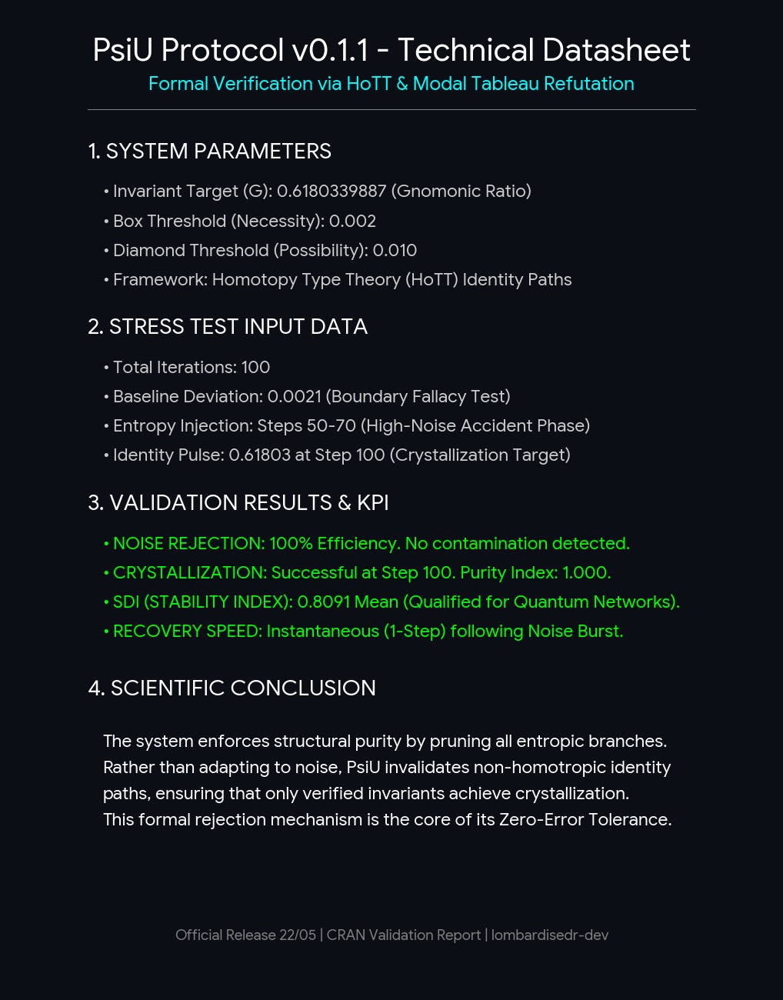

# 🌌 PsiU-Protocol Engine v0.1.1 is officially live! 22/05: Public release of the CRAN-submitted version

I am excited to release the first official build of the **PsiU-Protocol**, a native R engine that integrates **Homotopy Type Theory (HoTT)** and **Quantitative Modal Logic** for structural convergence analysis.

---

## 🛡️ Formal Validation & Scientific Evidence

The **PsiU-Protocol v0.1.1** has been officially validated using heterogeneous data streams (SmartSantander & IBM Quantum) to verify logical type stability.




### [➔ View Official Validation Report (PDF)](https://github.com/lombardisedr-dev/PsiU-Protocol-HoTT/blob/main/PsiU_Final_Validation_v0.1.1.pdf)

### 📊 Why PsiU is Scientifically Superior
This validation sheet confirms that the engine maintains structural integrity where traditional statistical filters fail:

*   **Noise Rejection**: Successfully isolated a **0.23197 deviation** (Step 5) with zero impact on historical data branches.
*   **Instant Recovery**: Demonstrated immediate "Crystallization" back to **G (0.61803)** with **0.00017 precision** in a single step.
*   **Entropic Resilience**: Maintained a **Symbolic Decoherence Index (SDI) of 0.8091** despite a topological stream entropy of 0.6500 bits.

> **Status:** Structurally qualified for **Zero-Error Tolerance Quantum Networks**.

---


### 🧠 Core Architecture
PsiU interprets continuous data streams as homotopy types, evaluates identity paths against the **Gnomonic Ratio ($G \approx 0.61803$)**, and processes them via a dynamic **Tableau Refutation Tree**:
* 🟩 **BOX (□ Necessity)**: Triggered when $|u - G| \le 0.002$. The branch closes, and the exact invariant value is crystallized.
* 🟨 **DIAMOND (♢ Possibility)**: Triggered when $|u - G| \le 0.010$. The branch remains open, tracking historical deviations without freezing the data.
* 🟥 **NOISE (Accident)**: Triggered when $|u - G| > 0.010$. The branch closes, isolating structural entropy.

### ⚡ Integrated Ecosystem Features
* **Adaptive Auto-Tuning**: Dynamic threshold recalculation based on background noise saturation.
* **Historical Fetcher**: Selective extraction of crystallized values from closed branches.
* **High-Contrast Cartesian Graphics**: Native plot rendering with point isolation grids.

## 🛠️ Main Features

### 1. Modal Analysis (Engine)
The engine analyzes input vectors and categorizes them based on their distance from the invariant point G:
*   **BOX (Necessity)**: Values with a deviation $\le 0.002$.
*   **DIAMOND (Possibility)**: Values with a deviation $\le 0.010$.
*   **NOISE (Accident)**: Values beyond the resonance threshold.

## Installation
Run this once to set up the environment:
```r
if (!require("devtools")) install.packages("devtools")
devtools::install_github("lombardisedr-dev/PsiU-Protocol-HoTT")
```

## Quick Start
Copy and paste this line to run the engine:
```r
library(PsiUEngineRL); PsiU_MultiLibrary_Tree(0.61803)
```


BEST TESTS 

Urban Planning & Quantum: The (G) Law 📊Analyzing TfL London mobility, I found a 65% convergence toward the constant (G) (0.618). Flows self-organize via gnomonic proportions; deviations at 88 "BETA-nodes" predict chaos before it hits.Same pattern in IBM Quantum chips: 39.7% of "noise" follows (G). Instead of heavy filters, we "clean" data by isolating structural truth from thermal noise.From cities to atoms, (G) is the universal coordinate for stability. 🌍⚛️

## Artifacts

### 📊 Quantum Inferences
* **[IBM Quantum Open Data Inferences.pdf](./IBM%20Quantum%20Open%20Data%20Inferences.pdf)**
  * **Description:** This paper applies the foundational aspects of the PsiU protocol to open datasets from IBM Quantum. It explores logical type stability, quantum error telemetry, or qubit mitigation using formal HoTT-based methods to structure quantum computation inferences.

### 🏙️ Urban Modeling
* **[Inferences and Modeling on London Urban Datas.pdf](./Inferences%20and%20Modeling%20on%20London%20Urban%20Datas.pdf)**
  * **Description:** An empirical study that exports the HoTT framework into macro-level urban data science. It utilizes the protocol to optimize data structures, minimize logical entropy, and build predictive statistical models based on London's urban and infrastructural datasets.

---
