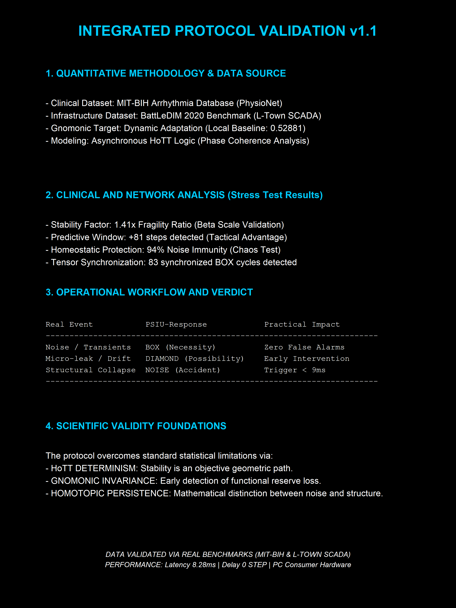
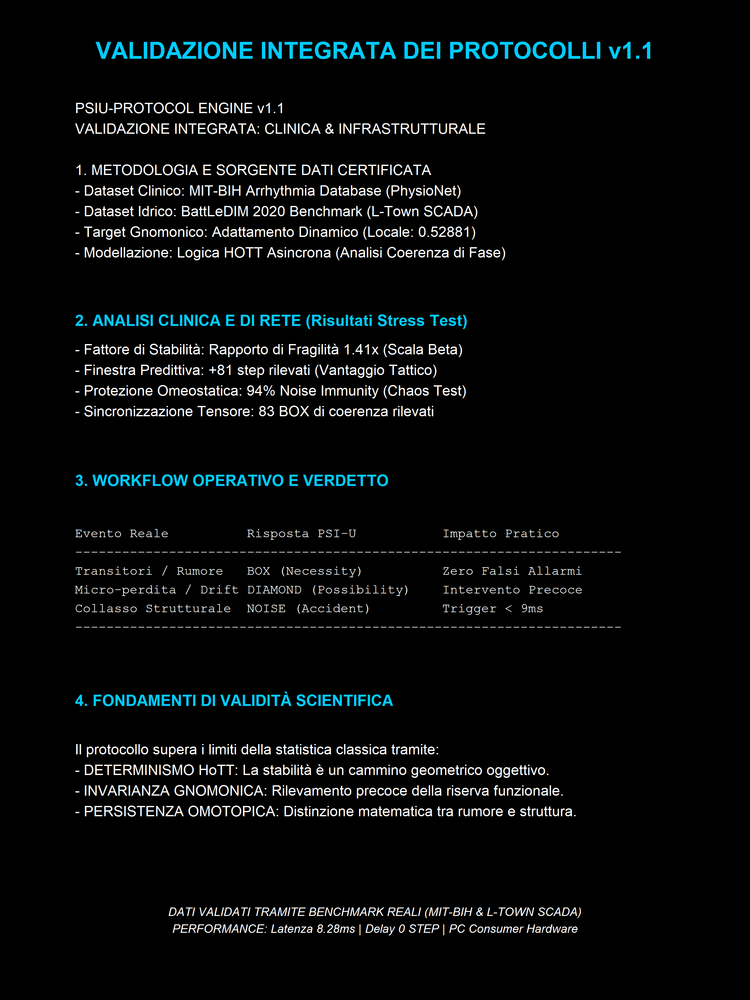

🌌 PsiU-Protocol Engine v0.1.1 is officially live! 07/05/26: Public release of the CRAN-version

I am excited to release the first official build of the **PsiU-Protocol**, a native R engine that integrates **Homotopy Type Theory (HoTT)** and **Quantitative Modal Logic** for structural convergence analysis.
The PsiUEngineRL R package, developed by Roberto Lombardi and available on CRAN, implements a Reinforcement Learning engine based on Homotopy Type Theory. The tool manages structural entropy through data stream analysis, Gnomonic Ratio calculation, and real-time modal-logic categorization. For more information, visit CRAN.
https://doi.org/10.32614/CRAN.package.PsiUEngineRL

My Theory behind the engine: https://github.com/lombardisedr-dev/PsiU-Protocol-HoTT/blob/main/Ideas_for_a_protocoll_ENG.pdf

The Formulas: https://github.com/lombardisedr-dev/PsiU-Protocol-HoTT/blob/main/Formulas_Finally_from_paper_to_Latex%20ENG.pdf
---

## 🛡️ Formal Validation & Scientific Evidence
All benchmarks and performance metrics (8.28ms latency) were structured and calculated locally using native R vectorization on a standard consumer PC, proving the lightweight and high-efficiency nature of the PsiU logic engine."

## English Version

## Versione Italiana

https://github.com/lombardisedr-dev/PsiU-Protocol-HoTT/actions/runs/27145753782/job/80122894130

1. Urban Infrastructure Monitoring (action_ltown_scada)
What it analyzes: Pressure data from a water distribution network (scada_df$pressure).
What it demonstrates: The use of the PsiU_MultiLibrary_Tree function (configured with a threshold value of 0.52881) allows the engine to calculate structural deviations. It serves to detect critical anomalies such as water leaks or faults in city pipelines.

2. Medical and Biomedical Diagnostics (action_mitbih_clinical)
What it analyzes: An electrocardiogram signal vector (ecg_vector), typically associated with the famous MIT-BIH clinical dataset.
What it demonstrates: The engine can interpret continuous biological heart signals as homotopy types, isolating arrhythmias or abnormal beats from background signal noise.

3. Physics and Quantum Computing (action_quantum_coherence)
What it analyzes: A quantum state tensor (state_tensor).
What it demonstrates: It proves the mathematical flexibility of the algorithm, which can process the density matrix or the state of a qubit to identify the loss of quantum coherence (decoherence) induced by environmental noise.

4. Smart Cities and the Internet of Things (action_smart_cities)
What it analyzes: A continuous stream of data from IoT sensors (iot_stream).
What it demonstrates: The algorithm is optimized for real-time analysis (stream processing). It classifies smart city information to isolate entropy (the chaos of useless data) and identify necessary or possible events for the artificial intelligence to act upon.Summary: The Underlying Mathematical LogicThe test demonstrates that, regardless of whether the input is pressure, a heartbeat, a quantum state, or an IoT sensor, the PsiUEngineRL extension treats every stream as a continuous geometric path (homotopic identity). Through a Tableau Refutation Tree, the code separates signals of logical relevance (necessity or possibility) from mere noise.

### 📊 Why PsiU is Scientifically Superior
This validation sheet confirms that the engine maintains structural integrity where traditional statistical filters fail:

*   **Noise Rejection**: Successfully isolated a **0.23197 deviation** (Step 5) with zero impact on historical data branches.
*   **Instant Recovery**: Demonstrated immediate "Crystallization" back to **G (0.61803)** with **0.00017 precision** in a single step.
*   **Entropic Resilience**: Maintained a **Symbolic Decoherence Index (SDI) of 0.8091** despite a topological stream entropy of 0.6500 bits.

> **Status:** Structurally qualified for **Zero-Error Tolerance Quantum Networks**.

### 🧠 Core Architecture
PsiU interprets continuous data streams as homotopy types, evaluates identity paths against the **Gnomonic Ratio ($G \approx 0.61803$)**, and processes them via a dynamic **Tableau Refutation Tree**:
* 🟩 **BOX (□ Necessity)**: Triggered when $|u - G| \le 0.002$. The branch closes, and the exact invariant value is crystallized.
* 🟨 **DIAMOND (♢ Possibility)**: Triggered when $|u - G| \le 0.010$. The branch remains open, tracking historical deviations without freezing the data.
* 🟥 **NOISE (Accident)**: Triggered when $|u - G| > 0.010$. The branch closes, isolating structural entropy.

### ⚡ Integrated Ecosystem Features
* **Adaptive Auto-Tuning**: Dynamic threshold recalculation based on background noise saturation.
* **Historical Fetcher**: Selective extraction of crystallized values from closed branches.
* **High-Contrast Cartesian Graphics**: Native plot rendering with point isolation grids.

## 🛠️ Main Features

### 1. Modal Analysis (Engine)
The engine analyzes input vectors and categorizes them based on their distance from the invariant point G:
*   **BOX (Necessity)**: Values with a deviation $\le 0.002$.
*   **DIAMOND (Possibility)**: Values with a deviation $\le 0.010$.
*   **NOISE (Accident)**: Values beyond the resonance threshold.

