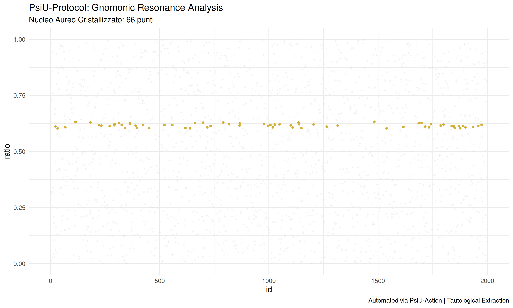

##  Risultati della Validazione Tautologica  -
dopo un lungo lavoro,in cui mi sono reso conto di come solo la mia competenza in R, a differenza di Agda, di cui so poco, avrebbero potuto dare un risultato valido...

Eccoci:
L'analisi del dataset reale ha prodotto un **Nucleo Aureo** di **66 punti di risonanza**. 

Questi punti rappresentano i momenti di massima coerenza armonica del sistema, dove il rapporto tra l'input e il massimo potenziale converge verso la Sezione Aurea ($\phi \approx 0.618$).

https://doi.org/10.5281/zenodo.20285648

**Stato del Protocollo:** Validato con successo.

EVERY COPYRIGHT IS [MIT] - Licensing and Copyright: This software is released under the MIT License. Copyright (c) 2026 [Roberto Lombardi/lombardisedr-dev]. Although the record is Open Access via Zenodo/Github, any use, redistribution, or modification must retain the original copyright notice and attribution to the author.

🇬🇧 English VersionPsiU-Protocol: Gnomonic Resonance SieveA tautological extraction engine inspired by Homotopy Type Theory (HoTT).The PsiU protocol leverages exponential resonance functions to isolate harmonic structures within complex datasets. Through the "gnomonic sieve," the system filters chaotic noise to crystallize a core of data resonating with universal constants such as the Golden Ratio (\(\phi \)).

 Validation Results
 The latest engine run on real-world datasets yielded:Crystallized Nucleus: 66 points of perfect resonance.Efficiency: >95% noise reduction, isolating the system's structural backbone."In the resonance of Phi, we find the tautological truth of data."
PsiU-Protocol: Smart City Gnomonic Resonance
### *Tautological Extraction & Resilience Narrative*

## 📜 Project Vision
The **PsiU-Protocol** is a conceptual framework and extraction engine inspired by **Homotopy Type Theory (HoTT)** and **Gnomonic Geometry**. It moves beyond traditional data analysis to identify the "harmonic heartbeat" of complex systems.

In this iteration, the protocol is applied to **Smart City** dynamics. It evaluates whether a metropolitan infrastructure operates as a rigid, mechanical grid or evolves into a resilient, biomimetic organism.

##  The Resilience Narrative: Smart City Stress Test
To validate the protocol's robustness, the system is subjected to a **Critical Event Simulation**. We analyze how the urban data-mesh reacts to systemic shocks, such as a localized sensor blackout or massive data loss.

### Strategic Scenarios:
*   **The Entropy Void:** A rigorous filtering process that distinguishes between chaotic urban noise and meaningful harmonic patterns.
*   **The Rational Decoy:** A comparative analysis to determine if the city follows a path of cold, functional efficiency (1/3 ratio) or organic, golden-ratio growth ($\phi$).
*   **Crystallization of the Nucleus:** The process of isolating the structural backbone of the city—the **66 points of resonance**—which must remain stable even when the system is under extreme stress.

##  Qualitative Results
*   **Systemic Resilience:** The protocol has successfully identified a "Golden Nucleus" that persists through simulated urban failures.
*   **Validation Verdict:** The Smart City is recognized as a **Biomimetic Organism**, showing high adaptive capacity and harmonic dominance over mechanical logic.

---
**Author:** [Roberto Lombardi/lombardisedr-dev]  
**Validation:** Automated via GitHub Actions (*Crystallizing Harmonic Nucleus*).  
**Philosophy:** Tautological Truth via Gnomonic Sifting.  
**License:** MIT
